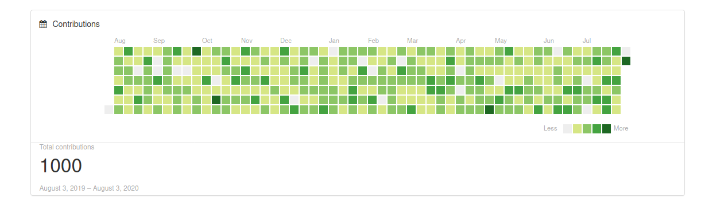
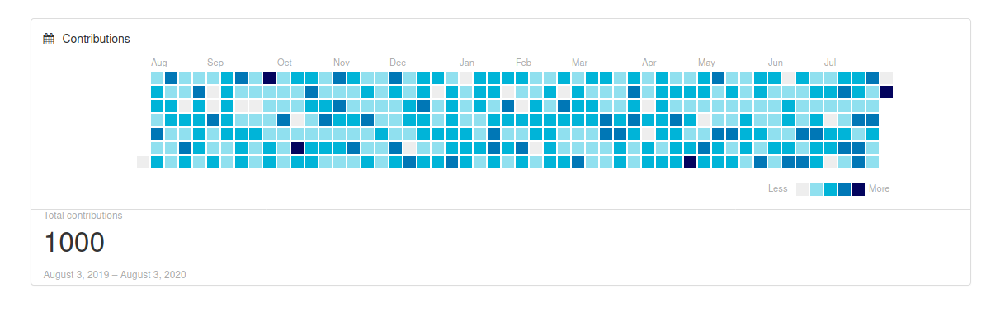
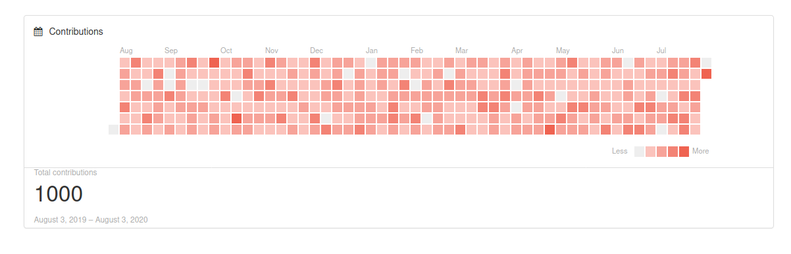
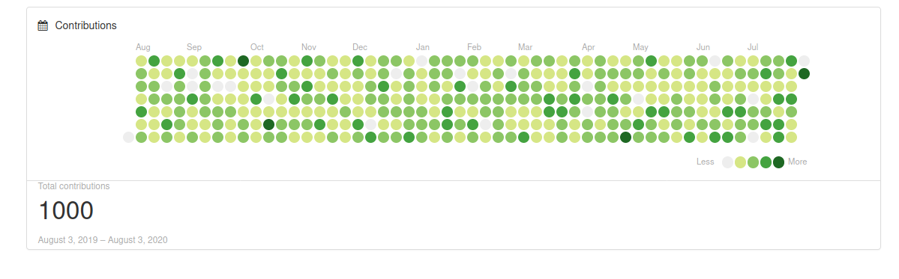
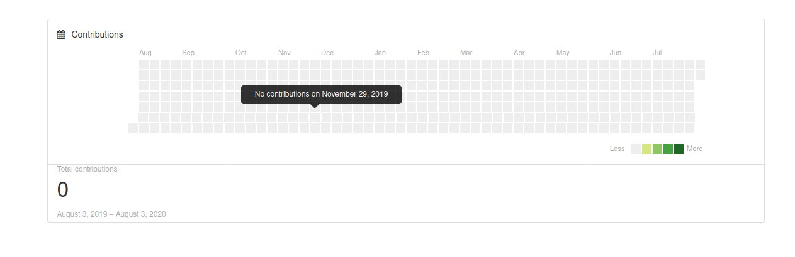

# GitHub Contributions Django

[](https://badge.fury.io/py/contributions-django)

Create a GitHub Contributions graph for Django!





This repository serves a Django app that can be used to generate a GitHub
contributions graph. An [example](example)
application is provided in the `example` folder that can be interacted with here.

## Quickstart

Install contributions django:

```bash
pip install contributions-django
```

Add it to your `INSTALLED_APPS`:

```python
    INSTALLED_APPS = (
        ...
        'contributions_django',
        ...
    )
```

To generate the graph in a view, import `generate_contributors_graph`. Give the function
a list of dates, and optionally a title to generate a context for your view:

```python
# -*- coding: utf-8 -*-

from .models import Event

from django_contributions.graphs import generate_contributors_graph
from django.shortcuts import render

def events_view(request):
    """Generate a papers graph using all Events dates
    """
    # Get a single list of timestamps for the view
    dates = Event.objects.values_list('date', flat=True)
    context = generate_contributors_graph(dates, title="Contributions")
    return render(request, "events/index.html", context)
```

And then in your template, include this snippet where you want the graph to show:

```html

```

Note that by default, the template includes bootstrap style (css) and font awesome icons.
See the next section, customization, if you already have these in your template
and want to remove them.

### Customization

If you want to customize any colors or text in the graph, you can do that in your
settings in a `CONTRIBUTIONS_DJANGO` section - the defaults are shown below.

```python
CONTRIBUTIONS_DJANGO = {

    # Gradients (0 or weak to stronger)
    'GRADIENT0': "#eee",
    'GRADIENT1': "#d6e685",
    'GRADIENT2': "#8cc665",
    'GRADIENT3': "#44a340",
    'GRADIENT4': "#1e6823",

    # The name to appear in tooltips (e.g., 12 contributions)
    'ITEM_NAME': 'contributions',

    # Include bootstrap style for outer part of template
    # set this to false if you already have it on your page
    'INCLUDE_BOOTSTRAP': True,
    'INCLUDE_FONTAWESOME': True,

    # The icon to show next to title. Set to None to remove.
    'ICON_CLASSES': "fa fa-calendar",

    # Instead of boxes, use circles.
    'CIRCLES': True


}
```

#### Shape

The cells can be circles if you set `CIRCLES` to true:



#### Colors

For gradients, you can find a color palette generation site like [this one](https://coolors.co/palettes/trending)
and customize gradients 1 through 4. You likely don't want to customize `GRADIENT0` since
that is the grey (empty) color. 

**green**

The default (akin to GitHub) is a set of greens:


**blue**

Here is the settings for a blue:

```python
# Gradients (0 or weak to stronger)
'GRADIENT0': "#eee", # this is empty gray, likely don't want to change this
'GRADIENT1': "#90E0EF",
'GRADIENT2': "#00B4D8",
'GRADIENT3': "#0077B6",
'GRADIENT4': "#03045E", # this should be the darkest
```


**pinks**

And pinks!

```
# Gradients (0 or weak to stronger) - below is green
'GRADIENT0': "#eee", # this is empty gray, likely don't want to change this
'GRADIENT1': "#fbc3bc",
'GRADIENT2': "#f7a399",
'GRADIENT3': "#f38375",
'GRADIENT4': "#ef6351", # this should be the darkest
```


Please open a pull request to add examples of your favorite palettes!

#### Template
If you want to customize the entire template, then you can create a copy of
the [default](contributions_django/templates/contributions_django/graph.html)
and include it in your view instead.

```html

```

### Dates

Importantly, with Django it's recommended to not use naive datetimes. In fact,
you'll get an error if you try saving a naive datetime to a model field. This means
that contributions_django must be flexible to accept naive or aware times. 
Here is how you can generate timestamps that are aware:

```python
from datetime import timedelta
from django.utils import timezone
import pytz

# get today and one year earlier
today = timezone.now()
last_year = today - timedelta(days=365)

# Create an event with a timezone aware timestamp
Event.objects.create(date=last_year, name="My Event")
```

And here is a naive timestamp:

```python
from datetime import datetime
timestamp = datetime.now()
```

Regardless of your choice, the contributions graph only cares about the day,
so it takes the `timestamp.date()` that is available regardless of being naive
or not.

### Example Application

You can develop or test interactively using the example (very simple) application
under [tests](tests). The [manage.py](manage.py) is located in the root directory
so it's easy to update your install and then interact with your test interface.
First create a virtual environment in the root and install the dependencies, 
mostly your application in development mode:

```bash
python -m venv env
source env/bin/activate
cd example
pip install -r requirements.txt
```

Then make migrations - this will create a basic Event model:

```bash
$  python manage.py makemigrations main
Migrations for 'main':
  example/apps/main/migrations/0001_initial.py
    - Create model Event
```

And migrate

```bash
$ python manage.py migrate
Operations to perform:
  Apply all migrations: admin, auth, contenttypes, main, sessions
Running migrations:
  Applying contenttypes.0001_initial... OK
  Applying auth.0001_initial... OK
  Applying admin.0001_initial... OK
  Applying admin.0002_logentry_remove_auto_add... OK
  Applying admin.0003_logentry_add_action_flag_choices... OK
  Applying contenttypes.0002_remove_content_type_name... OK
  Applying auth.0002_alter_permission_name_max_length... OK
  Applying auth.0003_alter_user_email_max_length... OK
  Applying auth.0004_alter_user_username_opts... OK
  Applying auth.0005_alter_user_last_login_null... OK
  Applying auth.0006_require_contenttypes_0002... OK
  Applying auth.0007_alter_validators_add_error_messages... OK
  Applying auth.0008_alter_user_username_max_length... OK
  Applying auth.0009_alter_user_last_name_max_length... OK
  Applying auth.0010_alter_group_name_max_length... OK
  Applying auth.0011_update_proxy_permissions... OK
  Applying main.0001_initial... OK
  Applying sessions.0001_initial... OK
```

Note that the example app creates the Event model with the sole purpose of
populating something with dates. You can use contributions_django for any
kind of visualization that provides a list of dates. 
At this point, if you run your server and browse to the index, you'll
see the empty graph, because we haven't created any events:

```bash
python manage.py runserver
```



Next, let's run the management command to create a bunch of random events -
1000 between today and last year, specifically. This is done by the example
management command [here](example/example/apps/main/management/commands/create_events.py):

```bash
$ python manage.py create_events
Creating 1000 events:

Creating Event joyous-lemon-3372 at 2020-07-12 00:56:15.675397+00:00
Creating Event misunderstood-leg-5849 at 2019-09-23 23:23:01.675397+00:00
Creating Event rainbow-leg-6361 at 2020-07-16 19:03:03.675397+00:00
Creating Event cowy-eagle-2288 at 2020-02-19 21:55:53.675397+00:00
...
```

You should then be able to run the application and see the events populated!

```bash
python manage.py runserver
```


## Development

I suggest that you follow the same steps to set up the example app:

```bash
python -m venv env
pip install -r requirements.txt
source env/bin/activate
```

And then you can change code under [contributions_django](contributions_django)
and test the live outcome with the example app.

## Many Thanks 

* [cookiecutter-djangopackage](https://github.com/pydanny/cookiecutter-djangopackage)
* The library is resurrected from the archived repository [contributions-graph](https://github.com/alexwlchan/contributions-graph) and updated for Django. The original license can be seen [here](.github/LICENSE-ALEX).
